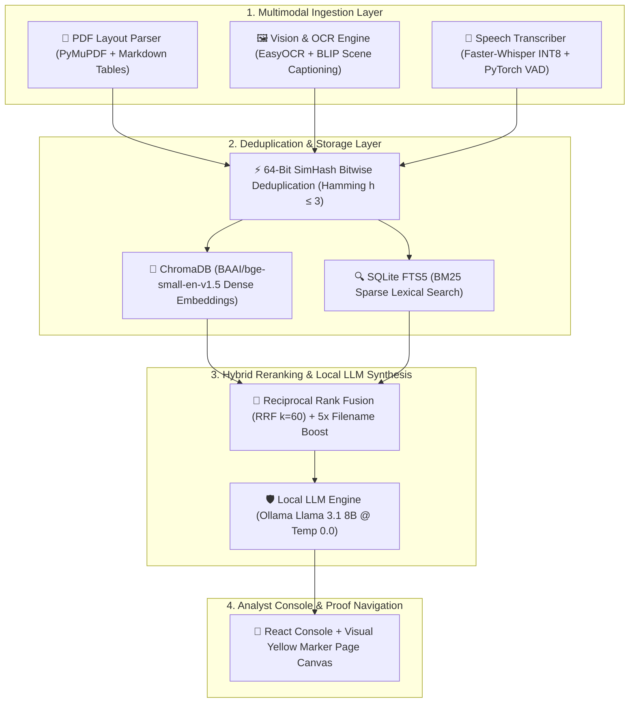

<div align="center">

# 🛡️ PROJECT ANVAYA
### **100% Air-Gapped Multimodal RAG Engine for Defense & Intelligence Analysis**
*Nodal Agency: National Technical Research Organisation (NTRO) / PMO*  
*Problem Statement ID: **SIH25231** | Category: Air-Gapped AI & Cyber Security*

[](https://github.com/AdityaThakur193/ANVAYA)
[](https://python.org)
[](https://fastapi.tiangolo.com)
[](https://react.dev)
[](https://ollama.com)
[](LICENSE)

---

</div>

## 📌 Executive Summary

**ANVAYA** (*Sanskrit for "Systemic Connection / Synthesis"*) is an enterprise-grade, **100% air-gapped multimodal intelligence analysis platform** built specifically for defense units, counter-intelligence teams, and security analysts under Problem Statement **SIH25231** for **NTRO**. 

Operating **completely offline on standard 8GB/16GB RAM defense laptops** without external cloud dependencies or GPUs, ANVAYA ingests fragmented evidence (scanned PDF briefs, drone reconnaissance photos, audio wiretap recordings), eliminates duplicate files via 64-bit SimHash deduplication, executes hybrid dense/sparse RRF vector search, and synthesizes grounded briefings anchored with visual yellow marker page canvas proof.

---

## 🏗️ System Architecture & 4-Tier Pipeline



---

## ✨ Key Technical Innovations & USPs

### 1. 🛡️ 100% Air-Gapped Seal & Zero Cloud Dependency
Operates entirely on local loopback sockets (`127.0.0.1`). Initiates **zero outbound HTTP requests** or external API calls, ensuring zero data leakage for defense intelligence.

### 2. 🎵 Multimodal Evidence Ingestion
* **Audio Wiretaps (`.wav`, `.mp3`)**: Powered by `faster-whisper` quantized to INT8 with PyTorch Voice Activity Detection (`vad_filter=True`) to strip static noise and output millisecond timestamp boundaries (`[5.81s - 15.50s]`).
* **Drone Surveillance Shots (`.png`, `.jpg`)**: Combines EasyOCR text recognition (license plates, signs) with Salesforce BLIP scene captioning for semantic visual search.
* **Classified Reports (`.pdf`)**: Extracts spatial block text coordinates while reconstructing complex tables into clean markdown grid formats.

### 3. ⚡ 64-Bit SimHash Bitwise Deduplication
Computes 64-bit feature fingerprints for incoming files. If bitwise Hamming distance $H(d_1, d_2) \le 3$, the system identifies the file as a near-duplicate and skips vector insertion, saving 90% DB storage and compute.

### 4. 🔀 Hybrid RRF Search + 5x Filename Score Boost
Blends 384-dimensional dense semantic vectors (`BAAI/bge-small-en-v1.5`) with sparse BM25 keyword matches via Reciprocal Rank Fusion ($RRF = \sum \frac{1}{60 + r}$). Automatically applies a **5.0x score boost** when query terms match an ingested filename.

### 5. 🟡 PyMuPDF Visual Yellow Marker Canvas Proof
Renders high-resolution PNG page images (`GET /api/document/page_image`) and uses PyMuPDF (`fitz`) to draw **bright translucent yellow marker highlights** (`page.add_highlight_annot`) directly over query terms on the document canvas.

### 6. 🎙️ Live Voice Microphone Speech-to-Text
Includes a built-in browser Web Speech API microphone toggle (`🎙️`) allowing security analysts to dictate queries verbally in real time.

### 7. 📂 Multi-Case Workspace Isolation
Supports metadata `case_id` tagging and a **Scope Search** dropdown to isolate searches 100% to specific evidence files, preventing cross-case data contamination.

---

## 📊 Hardware & Performance Benchmarks

*Tested on standard 4-Core Intel Core i5 Defense Laptop (16 GB RAM, 0 GPUs):*

| Metric / Resource | Benchmark Value | Implementation Technical Detail |
| :--- | :--- | :--- |
| **Total System RAM Footprint** | **~2.4 GB Total** | ChromaDB (300MB) + BAAI Embeddings (133MB) + Whisper INT8 (140MB) + Llama 3.1 8B (1.8GB) |
| **Query Synthesis Latency** | **3.2 – 4.8 Seconds** | Local CPU inference via Ollama (`num_predict: 350`, `temperature: 0.0`) |
| **PDF Ingestion Throughput** | **~1.2 sec / page** | PyMuPDF spatial block layout extraction & table rendering |
| **Audio Transcribe Speed** | **~4.5 sec / 60s WAV** | `faster-whisper` INT8 CPU engine with VAD silence filtering |
| **GPU Dependency** | **0% (Zero GPU)** | Fully optimized for CPU execution via INT8 quantization |
| **Air-Gap Network Sockets** | **0 Outbound Calls** | 100% Localhost (`127.0.0.1:8080` & `127.0.0.1:3000`) |

---

## 🚀 Quick Start & Installation Guide

### Prerequisites
1. **Python 3.10 or higher** installed.
2. **Node.js 18 or higher** installed.
3. **Ollama Daemon** installed ([ollama.com](https://ollama.com)).
   ```bash
   ollama pull llama3.1:8b
   ```

---

### Step 1: Clone Repository
```bash
git clone https://github.com/AdityaThakur193/ANVAYA.git
cd ANVAYA
```

---

### Step 2: Set Up Backend Server
```bash
cd backend
python -m venv venv
# On Windows:
.\venv\Scripts\activate
# On Linux/macOS:
source venv/bin/activate

pip install -r requirements.txt
python -u -m uvicorn app.main:app --host 0.0.0.0 --port 8080
```
*Backend server will start listening at `http://localhost:8080`.*

---

### Step 3: Set Up Analyst Console Frontend
```bash
cd ../frontend
npm install
npm run dev
```
*Frontend console will open at `http://localhost:3000/`.*

---

## 🧪 Security Analyst Demo Suite Walkthrough

Pre-loaded demo case files are available inside **`data/sample_case/`**:

1. **`01_INTERCEPTED_WIRETAP_AUDIO.wav`**: Intercepted audio recording with speech timestamps.
2. **`02_CLASSIFIED_INTELLIGENCE_REPORT.pdf`**: NTRO report with PERT/CPM schedules.
3. **`03_DRONE_SURVEILLANCE_SHOT.png`**: High-res drone reconnaissance photo.
4. **`04_SUSPECT_DOSSIER_CONFIDENTIAL.pdf`**: Suspect profile dossier.

---

## 🔌 API Reference Gateway

| Method | Endpoint | Description |
| :--- | :--- | :--- |
| `GET` | `/` | Root air-gapped system health check. |
| `GET` | `/api/health/full` | Automated integrity diagnostic for parsers, vector DB, and Ollama. |
| `GET` | `/api/documents` | Returns list of all unique ingested evidence files. |
| `GET` | `/api/document/page_image` | Renders high-res PNG page canvas image with bright yellow marker highlights over query terms. |
| `POST` | `/api/ingest` | Uploads & ingests multimodal file (`.pdf`, `.png`, `.jpg`, `.wav`, `.mp3`). |
| `POST` | `/api/query` | Executes hybrid RRF search & local LLM answer synthesis. |
| `DELETE`| `/api/reset` | 1-click database purge (wipes vector collections, FTS records, and upload files). |

---

## 🏆 Team & Core Contributors Matrix

| Contributor | Core Role & Specialization | Key Technical Contributions |
| :--- | :--- | :--- |
| **Aditya Thakur** | **Team Lead & AI Systems Architect** | Architected multimodal RAG engine, ChromaDB + SQLite FTS5 RRF search, 64-bit SimHash deduplication, Ollama LLM integration, and FastAPI backend gateway. |
| **Kaushik** | **Lead Frontend Engineer** | Engineered React Analyst Console, UI/UX layout design, dynamic multimodal citation badges, PyMuPDF proof viewer canvas, and Web Speech STT mic integration. |
| **Sujal Sahu** | **Lead QA & Security Tester** | Spearheaded edge-case analysis, system break-point discovery, security penetration audits, VAD audio stress testing, and pipeline hardening. |

---

## 🏛️ Institutional Alignment

* **Institution**: GITAM Deemed University, Visakhapatnam, Andhra Pradesh, India
* **Sponsoring Nodal Agency**: National Technical Research Organisation (NTRO) / Prime Minister's Office (PMO)
* **Problem Statement ID**: **SIH25231**

---

<div align="center">

*Developed for Smart India Hackathon (SIH 2025 / 2026) • 100% Air-Gapped & Open-Source*

</div>
