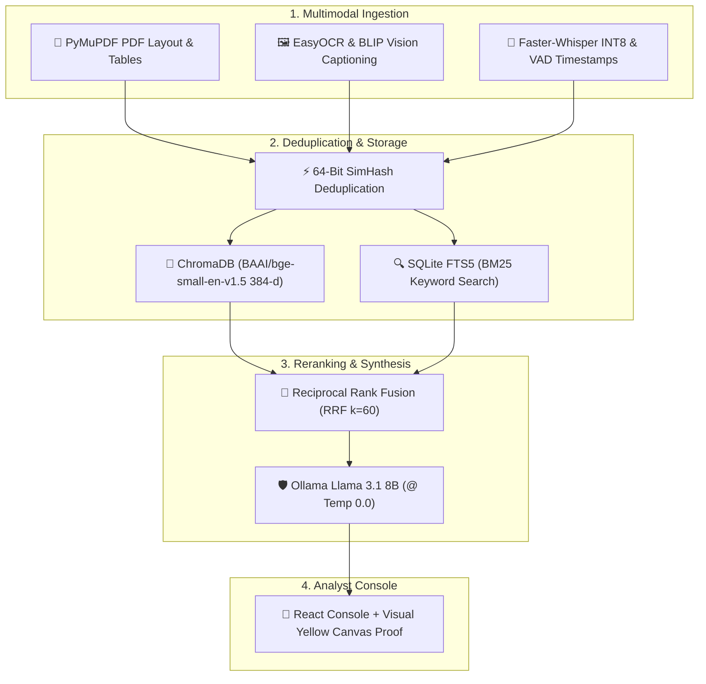

<div align="center">

# 🛡️ PROJECT ANVAYA
### **Air-Gapped Multimodal RAG Engine for Defense Intelligence**
*National Technical Research Organisation (NTRO) / PMO • Problem Statement ID: **SIH25231***

[](https://github.com/AdityaThakur193/ANVAYA)
[](https://python.org)
[](https://fastapi.tiangolo.com)
[](https://react.dev)
[](https://ollama.com)

---

</div>

## 📌 Overview

**ANVAYA** is a **100% air-gapped multimodal intelligence analysis platform** built for defense units and counter-intelligence teams under Problem Statement **SIH25231** for **NTRO**.

Operating **completely offline** without external cloud dependencies or GPUs, ANVAYA ingests PDF reports, drone photos, and audio wiretaps, eliminates duplicate files via 64-bit SimHash deduplication, executes hybrid dense/sparse vector search, and synthesizes grounded briefings anchored with visual yellow marker page canvas proof.

---

## 🏗️ Architecture Flow



---

## ✨ Key Features

* 🛡️ **100% Offline Air-Gapped Seal**: 0 cloud API calls; runs entirely on `127.0.0.1`.
* 🎵 **Audio Wiretap Engine**: Speech transcription with millisecond timestamping (`[5.81s-15.5s]`).
* 🖼️ **Drone Reconnaissance Vision**: OCR text recognition + scene captioning for aerial photos.
* 📄 **Spatial PDF Layout Engine**: Preserves spatial block text & markdown grid table reconstruction.
* ⚡ **SimHash Deduplication**: 64-bit feature fingerprints drop duplicate files ($h \le 3$), saving 90% DB bloat.
* 🔀 **Hybrid RRF Search**: Blends ChromaDB vectors + SQLite FTS5 sparse text with 5x Filename Score Boost.
* 🟡 **Visual Yellow Marker Canvas**: Renders document page canvas with bright yellow marker highlights over query terms.
* 🎙️ **Live Voice STT Mic**: Real-time browser speech-to-text input dictation.

---

## 🚀 Quick Start

### 1. Backend Setup
```bash
cd backend
python -m venv venv
source venv/bin/activate  # On Windows: .\venv\Scripts\activate
pip install -r requirements.txt
python -u -m uvicorn app.main:app --host 0.0.0.0 --port 8080
```

### 2. Frontend Setup
```bash
cd frontend
npm install
npm run dev
```
*Open **http://localhost:3000** in your browser.*

---

## 🏆 Team & Core Contributors

| Contributor | Role | Key Contributions |
| :--- | :--- | :--- |
| **Aditya Thakur** | **Team Lead & AI Systems Architect** | Multimodal RAG Engine, ChromaDB+FTS5 RRF Search, SimHash Deduplication, Ollama LLM Gateway. |
| **Kaushik** | **Lead Frontend Engineer** | React Analyst Console UI/UX, Dynamic Asset Badges, Visual Proof Canvas, Web Speech Mic STT. |
| **Sujal Sahu** | **Lead QA & Security Tester** | Edge-Case Analysis, Break-Point Discovery, VAD Audio Stress Testing, Security Auditing. |

---

<div align="center">

*GITAM Deemed University • NTRO Sponsoring Nodal Agency • SIH25231*

</div>
